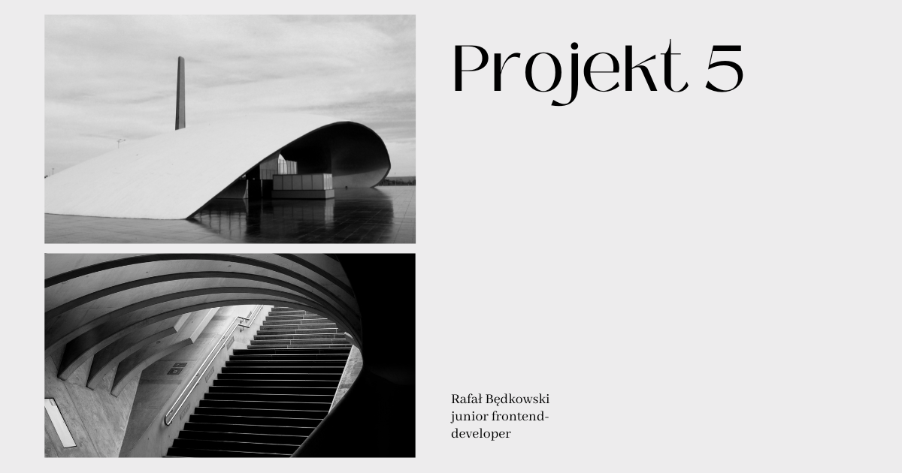
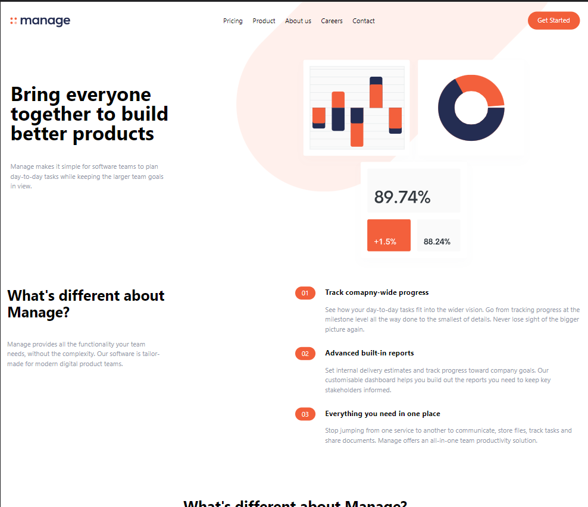
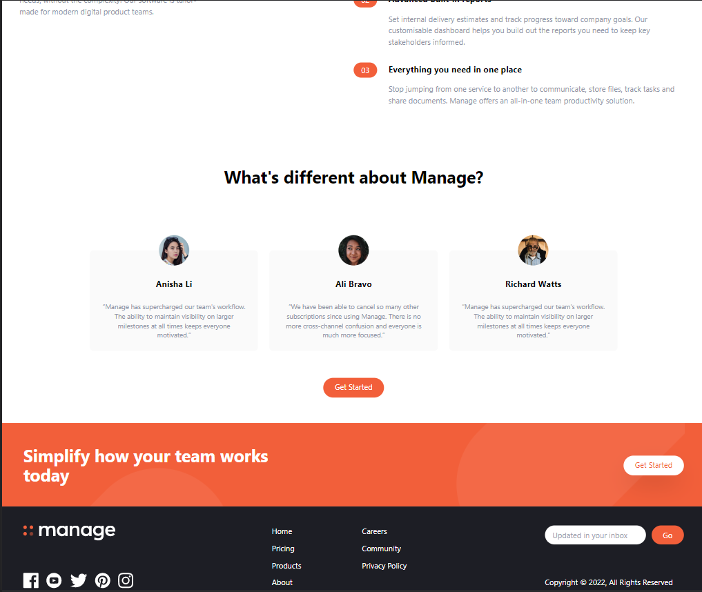
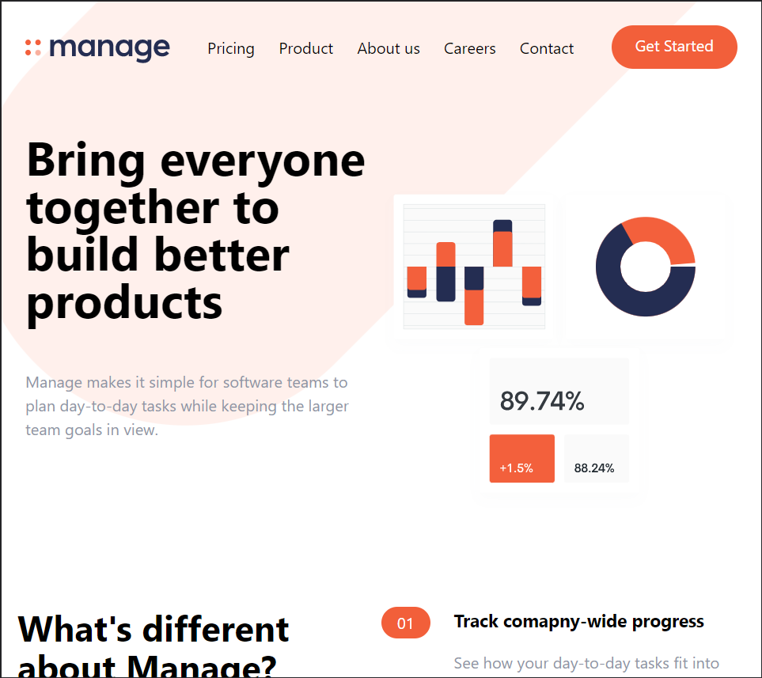
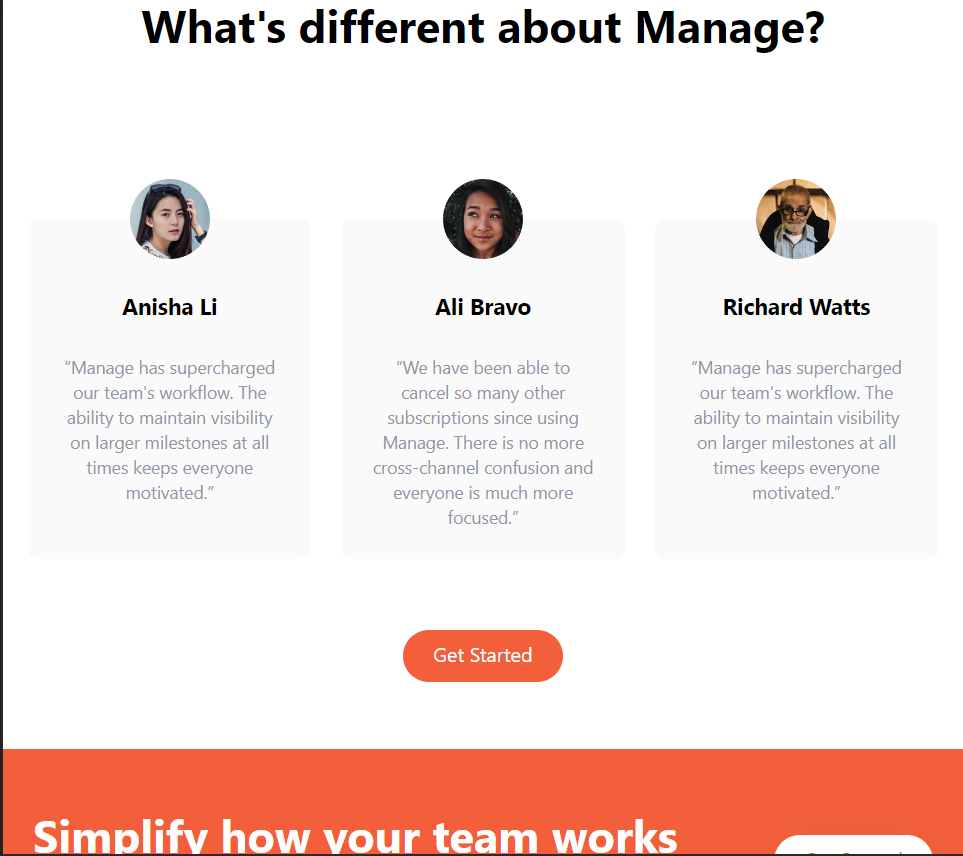

# Tailwind Landing page
> Live demo [_here_](https://rafal-bedkowski.github.io/huddleLandingPage/).

## Table of Contents
* [General Info](#general-information)
* [Technologies Used](#technologies-used)
* [Screenshots](#screenshots)
* [Setup](#setup)
* [Project Status](#project-status)

## General Information
- Simple landing page mostly build with the Tailwind CSS framework

## Technologies Used
- HTML 5 (with semantic tags)
- Tailwind CSS
- NPM Webpack starter kit from Frontend Training course - providing couple of packages like webpack dev-server, babel etc.  

## Screenshots

## Setup

git clone the project on your machine  
locally install the npm webpack `npm install --save-dev webpack`  

Scripts you can use:

`npm run start` - to run webpack dev-server development mode  
`npm run build` - to run production mode  
`npm run publish` - to publish project on githubpages  

## Project Status
Project is: _complete_ 
